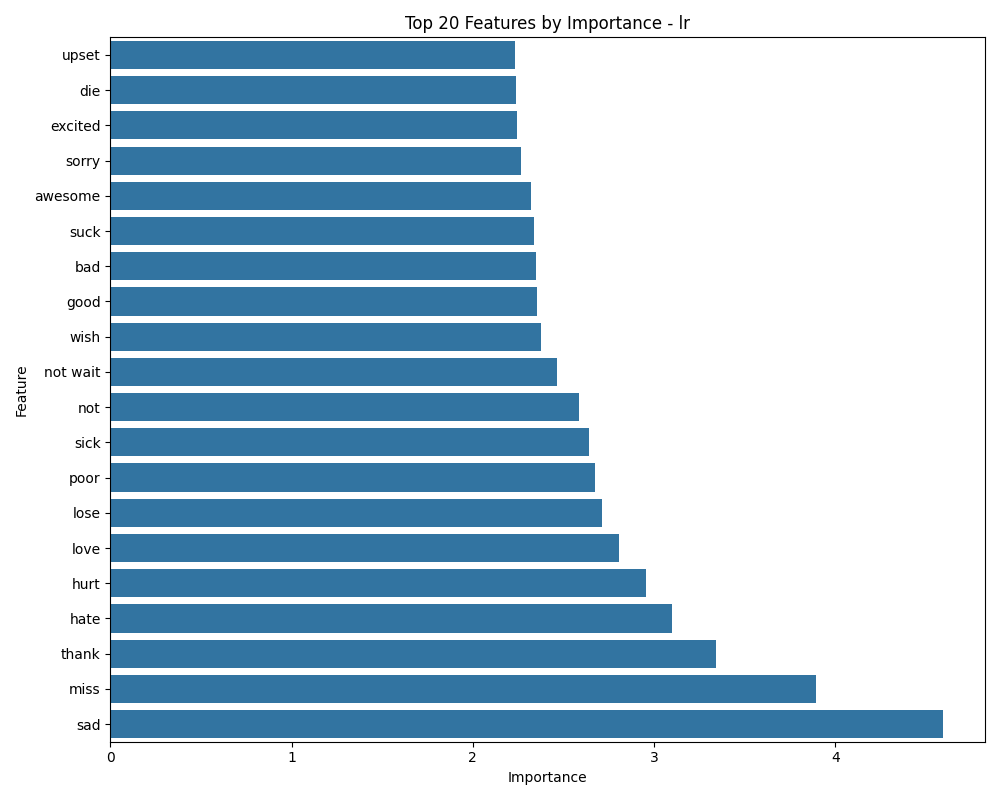

---

### ✅ Here's a clean, complete version of the README:

```markdown
# Sentiment Analysis Pipeline 🧠📊

A complete end-to-end sentiment analysis project that processes social media text data, extracts features, trains multiple machine learning models, evaluates their performance, and deploys the best-performing model in a production-ready pipeline.

## 🚀 Project Overview

This project demonstrates a practical NLP pipeline for sentiment classification using a Twitter dataset. It covers the entire machine learning workflow from preprocessing to model deployment and includes visualizations and saved artifacts for reproducibility.

### 🔍 Goals:
- Preprocess and clean raw tweet data.
- Extract informative textual features using TF-IDF.
- Train and evaluate multiple classification models.
- Select and persist the best model based on F1-score.
- Save the full pipeline for deployment and future predictions.

---

## 📁 Project Structure

```
data-analytics-ml-project/
│
├── data/
│   ├── raw/                      # Raw data (if available)
│   └── processed_tweets.csv      # Cleaned and tokenized data
│
├── output/
│   ├── figures/                  # Visualizations of feature importance
│   └── models/                   # Saved models and vectorizer files
│
├── main.py                       # Entry point to run the full pipeline
├── utils/                        # Custom feature extraction and helper functions
└── README.md                     # Project documentation (you're reading it)
```

---

## ⚙️ How to Run

1. **Clone the repository**

```bash
git clone https://github.com/AbdullahShareef79/data-analytics-ml-project.git
cd data-analytics-ml-project
```

2. **Install dependencies**

```bash
pip install -r requirements.txt
```

3. **Run the pipeline**

```bash
python main.py
```

---

## ✅ Features

- **TF-IDF Vectorization** with top keywords analysis.
- **Three models** trained: Logistic Regression, Multinomial Naive Bayes, and Linear SVM.
- **Model evaluation metrics**: Accuracy, Precision, Recall, and F1-Score.
- **Best model saved** for deployment.
- **Feature importance visualization** using Logistic Regression weights.
- Modular and extensible pipeline design.

---

## 📊 Results

| Model                  | F1 Score |
|------------------------|----------|
| Logistic Regression    | 0.7367   |
| Multinomial Naive Bayes| 0.7202   |
| Linear SVM             | 0.7256   |

✅ Logistic Regression selected as the best-performing model.



> View all figures and saved models [here](https://github.com/AbdullahShareef79/data-analytics-ml-project/tree/main/output)

---

## 🛠 Future Improvements

- Use transformer models like BERT for contextual understanding.
- Perform hyperparameter tuning using GridSearchCV or Optuna.
- Implement explainability (e.g., SHAP or LIME).
- Deploy the pipeline via FastAPI or Flask for real-time predictions.

---

## 👨‍💻 Author

**Abdullah Shareef**  
MSc NLP Student | Data Enthusiast | AI for Social Good  
📍 Trier University  
📬 [LinkedIn](https://www.linkedin.com/in/abdullah-shareef-nlp)

---

## 📜 License

This project is licensed under the MIT License.
```

---
